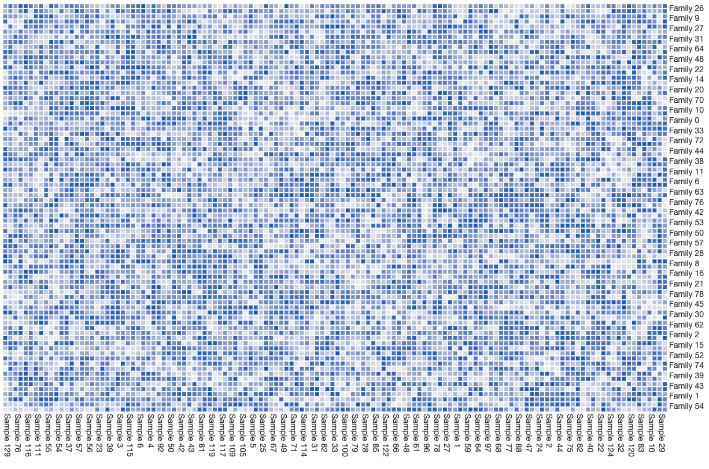

# Unipept heatmap
This repository contains a standalone version of the Unipept heatmap. The heatmap is part of the
Unipept visualizations project and will be merged with that repository in the future.



A live example of this heatmap can be found on 
[ObservableHQ](https://observablehq.com/@pverscha/unipept-heatmap-v2-live-example).

## Features
* Uses native Canvas to render the heatmap
* Renders at maximum refresh rate for heatmaps with up to 300 * 300 elements
* Zoomable and draggable
* Supports clustering of the values to improve readability
* Fully animated
* Completely customizable

## Requirements
All necessary requirements are automatically installed when installing this package through NPM. 

## Installation
```
npm install unipept-heatmap
```
This package can easilty be installed from NPM and comes with TypeScript typings by default.

## Quickstart
Setting up the Unipept heatmap is very simple. 

1. Install the package through npm (see installation
instructions).
2. Add a `div`-element to the page in which your visualization should be displayed.
3. Invoke the Heatmap constructor with a reference to the `div`-element, and pass the data that should be visualized. 
4. Call the `cluster()`-method on the newly created Heatmap-object to start clustering the heatmap. This method performs
the UPGMA clustering technique and a heuristic to reorder the found clusters for a more comprehensive result.

## API
The Unipept Heatmap has an extensive API that allows you to completely customize the appearance and behaviour of the
visualization itself. We'll go over each of the different objects that are exposed by the API.

### Heatmap
#### `constructor`
The constructor of the `Heatmap` class automatically starts rendering the heatmap upon invocation and has following
signature:

* `elementIdentifier: HTMLElement`: The `HTMLElement` in which the heatmap should be rendered.
* `values: number[][]`: A two-dimensional array with all the values that should be visualized. The given numbers should
all be in the [0, 1] interval.
* `rowLabels: string[]`: Labels for the rows of the Heatmap.
* `columnLabels: string[]`: Labels for the columns of the Heatmap.
* `options: HeatmapSettings` (*optional*): Can be used to configure the Heatmap before rendering. See 
[below]("#HeatmapSettings") for all options that are currently supported.

#### `async cluster: Promise<void>`
By calling `cluster()` upon a previously constructed heatmap object, the rows and columns of the heatmap are clustered
using the UPGMA-algorithm, and reordered using the MOLO-heuristic. Rows are clustered first, then columns. The heatmap
will render an animation to reorder the different rows and columns (if animations are enabled) clearing up what happens
for the user.

#### `reset`
The complete visualization can be rerendered by calling `reset()`.

### HeatmapValue
A HeatmapValue object represents one value (or one grid) in the heatmap. This interface keeps track of the decimal
value, row index, column index and color for one square of the grid.

* `value`: Decimal value that is being rendered on the heatmap.
* `rowId`: Row index of the current position of this value in the heatmap grid.
* `colId`: Column index of the current position of this value in the heatmap grid.
* `color`: Color that's associated with this value.

### HeatmapSettingss
A `HeatmapSettings` object can be used to fully configure the heatmap and specifies a variety of properties that can
be used to complete change the heatmap:

* `width` (*optional*, default = 800): Maximum width of the visualization in pixels.
* `height` (*optional*, default = 800): Maximum height of the visualization in pixels.
* `enableTooltips` (*optional*, default = true): Are tooltips shown when hovering over an element in the heatmap? 
* `initialTextWidth` (*optional*, default = 100): The amount of pixels that can maximally be used for row labels when 
initially rendering the heatmap.
* `initialTextHeight` (*optional*, default = 100): The amount of pixels that can maximally be used for column labels 
when initially rendering the heatmap.
* `squarePadding` (*optional*, default = 2): Padding between squares in the heatmap grid (in pixels). Set to 0 for no 
padding.
* `visualizationTextPadding` (*optional*, default = 4): Padding between the visualization and the labels (in pixels). 
This padding is applied to both the row and column labels.
* `fontSize` (*optional*, default = 14): Font size for labels, when current label is not highlighted. Size must be given
in pixels.
* `labelColor` (*optional*, default = "#404040"): Color of label text, when label is not highlighted. Value should be a 
valid HTML color string (hexadecimal).
* `highlightSelection` (*optional*, default = true): Should the row, column and square that are currently being hovered 
by the mouse cursor be highlighted?
* `highlightFontSize` (*optional*, default = 16): Font size for labels, when current label is highlighted. Size must be 
given in pixels.
* `highlightFontColor` (*optional*, default = "black"): Color of label text, when label is highlighted. Value should be
a valid HTML color string (hexadecimal).
* `className` (*optional*, default = "heatmap"): Classname that's internally used for the object.
* `animationsEnabled` (*optional*, default = true): Determines if animations should be rendered when rows and columns 
are reordered.
* `animationDuration` (*optional*, default = 2000): Determines how long animations should take, if they are enabled. 
Time should be given in milliseconds.
* `transition` (*optional*, default = `Transition.easeInEaseOutCubic`): Transition effect that should be applied to the 
reordering animation. Pass a predefined function from the [Transition]("#Transition") namespace, or provide your own 
function that maps a value from [0, 1] to [0, 1].
* `minColor` (*optional*, default = "#EEEEEE"): Color value that should be used to render squares with the lowest 
possible value. All other values between min and max value will be colored with a color value interpolated between 
minColor and maxColor. Value should be a valid HTML color string.
* `maxColor` (*optional*, default = "#1565C0"): Color value that should be used to render squares with the highest 
possible value. All other values between min and max value will be colored with a color value interpolated between 
minColor and maxColor. Value should be a valid HTML color string.
* `colorBuckets` (*optional*, default = 50): How many distinct colors between minColor and maxColor should be used for 
the heatmap (this value thus determines the size of the color palette). Increasing this value will decrease the 
heatmap's performance.
* `getToolTip` (*optional*, default = generic tooltip function) Returns the html to use as tooltip for a cell. Is called
with a HeatmapValue that represents the current cell and the row and column objects associated with the highlighted 
cell as parameters. The result of getTooltipTitle is used for the header and getTooltipText is used for the body of 
the tooltip by default. This function needs to return a string representing HTML-code that will be executed and 
receives 3 parameters:
    * `HeatmapValue`: which represents the current cell over which the user is hovering.
    * `HeatmapFeature`: an element that represents the current row over which the user is hovering.
    * `HeatmapFeature`: an element that represents the current column over which the user is hovering.
**NOTE: Be very cautious in passing user input directly as a result of this function. Please always sanitize the user's
input before returning it, as this might lead to reflected XSS-attacks.**
* `getTooltipTitle` (*optional*, default = generic title function) Returns text that's being used for the title of a 
tooltip. This tooltip provides information to the user about the value that's currently hovered by the mouse cursor.
This function needs to return a string representing HTML-code that will be executed and 
receives 3 parameters:
    * `HeatmapValue`: which represents the current cell over which the user is hovering.
    * `HeatmapFeature`: an element that represents the current row over which the user is hovering.
    * `HeatmapFeature`: an element that represents the current column over which the user is hovering.
**NOTE: Be very cautious in passing user input directly as a result of this function. Please always sanitize the user's
input before returning it, as this might lead to reflected XSS-attacks.**
* `getTooltipText` (*optional*, default = generic body function) Returns text that's being used for the body of a 
tooltip. This tooltip provides information to the user about the value that's currently hovered by the mouse cursor.
This function needs to return a string representing HTML-code that will be executed and 
receives 3 parameters:
    * `HeatmapValue`: which represents the current cell over which the user is hovering.
    * `HeatmapFeature`: an element that represents the current row over which the user is hovering.
    * `HeatmapFeature`: an element that represents the current column over which the user is hovering.
**NOTE: Be very cautious in passing user input directly as a result of this function. Please always sanitize the user's
input before returning it, as this might lead to reflected XSS-attacks.**

### Transition
This namespace provides a few different transitions that can be used to tweak the animations for this heatmap.

#### easeInEaseOutCubic


#### easeInCubic


#### easeOutCubic


#### easeInEaseOutElastic


#### easeInElastic


#### easeOutElastic

